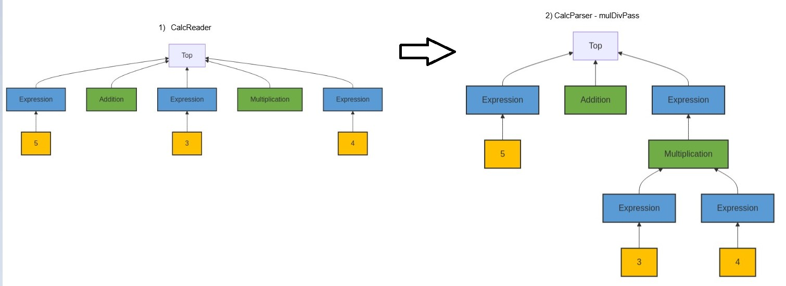
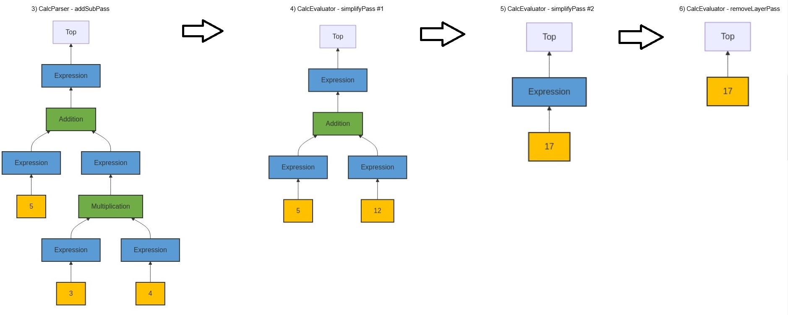

# ```calc/```

## Overview
A parser and evaluator for arithmetic expressions given in string inputs; supporting addition, subtraction, multiplication, and division operations.


## Motivation
The calculator exists as a practical example demonstrating how DCal can be leveraged to parse languages and manipulate ASTs, with many of DCal's core features such as ```Wellformed```, ```PassSeq```, and ```SeqPattern``` being heavily used.


## Components

### 1. ```package.scala```
Defines all of the ```Token``` types that are used and provides a wellformed definition representing how the AST should be structured once fully built.


### 2. ```CalcReader.scala```
```CalcReader``` is the lexer that converts input strings into tokens. 

It contains a wellformed definition of the initial token types with ```Number``` tokens that're wrapped around ```Expression``` and ```Op``` tokens for operations.

The ```rules``` method uses byte-level pattern matching to create tokens for numbers and operators and skip anything else.


### 3. ```CalcParser.scala```
```CalcParser``` is the parser, transforming the flat list of tokens into a structured AST.

The wellformed definition adds new ```Operation``` token types that have 2 ```Expression``` children. Also, ```Expression``` tokens have a new definition, being able to wrap both ```Number``` tokens as well as ```Operation``` tokens.

```mulDivPass``` and ```addSubPass``` both create nested expressions and splicing the old ```Op``` tokens that were previously defined. Both methods do this by pattern matching on the sequence of ```(Expression, Op, Expression)``` and replacing this sequence with

```
Expression(
  Operation(
    Expression,
    Expression
  )
)
```

```mulDivPass``` is executed before ```addSubPass``` to create precedence, allowing multiplication and division operations to be nested deeper than addition and subtraction operations in the AST. 


### 4. ```CalcEvaluator.scala```
```CalcEvaluator``` simplifies the AST and computes the value of the arithmetic expression.

The wellformed definition is imported from ```package.scala```, picking up with the AST structure of where ```CalcParser``` left off.

```simplifyPass``` splices all expressions repeatedly until there's only a single expression node at the top of the AST structure. The pass uses a bottom-up strategy to begin with simplifying the base-case expressions with no nesting as it goes up the AST. 

The pass sequence pattern matches on

```
Expression(
    Operation(
        Expression(
            Number
        ),
        Expression(
            Number
        )
    )
)
```

and replaces the sequence with ```Expression(Number)```. The remaining ```Expression``` token at the end of the pass contains the value of arithmetic expression.

```removeLayerPass``` splices the ```Expression``` token at the top of the AST and replaces it with the ```Number``` token that was wrapped inside. Pattern matching is done on the sequence of ```Expression(Number)``` and replaces it with just ```Number```.


## Usage
To learn how to use the calculator, ```CalcReader.test.scala``` contains methods (```parse```, ```read```, ```evaluate```) that execute the different components of the calculator.


## Example
The following images demonstrates the state of the AST after each pass with the input "5 + 3 * 4". 



